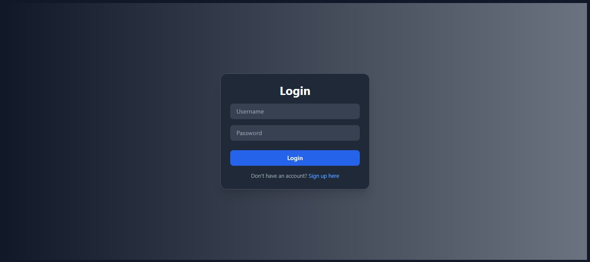
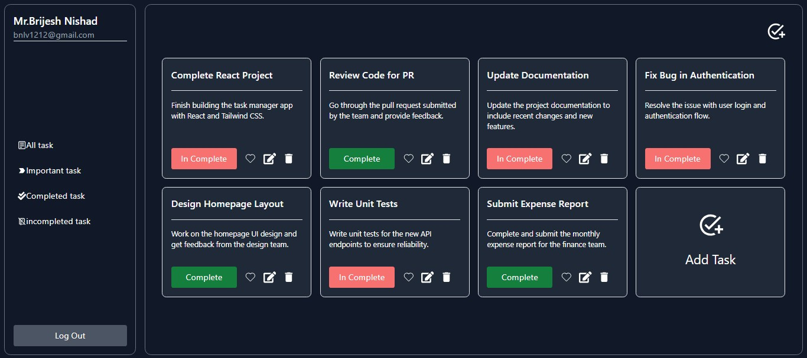

# TaskManager


## 📋 Project Description

TaskManager is a **productivity tool** designed to help you manage your tasks effectively. With an intuitive user interface and powerful task-tracking features, TaskManager allows you to add, update, delete, and track your tasks easily. It's perfect for personal use, team collaboration, and anyone looking to stay organized and increase productivity.

### **Features:**
- ✔️ Create, read, update, and delete tasks.
- 📂 Categorize tasks with labels (e.g., Work, Personal, Urgent).
- ✅ Mark tasks as complete.
- 🔎 Filter tasks by category, due date, or completion status.
- ⏰ Set deadlines and reminders for important tasks.
- 🚀 Prioritize tasks based on urgency.

---

## 🚀 Getting Started

These instructions will help you set up and run the TaskManager project on your local machine for development and testing purposes.

### Prerequisites

Make sure you have the following installed:

- **Node.js**: [Download Node.js](https://nodejs.org)
- **npm**: Comes installed with Node.js
- **Git**: [Download Git](https://git-scm.com)

### Installation

1. Clone this repository to your local machine:

    ```bash
    git clone https://github.com/tecresearch/taskmanager.git
    ```

2. Navigate to the project directory:

    ```bash
    cd taskmanager
    ```

3. Install dependencies:

    ```bash
    npm install
    ```

4. Run the development server:

    ```bash
    npm start
    ```

   Open your browser and visit [http://localhost:3000](http://localhost:3000) to see TaskManager in action.

---

## 💻 Usage

Once TaskManager is running, you can use the following features:

### 1. **Create a Task**
- Click on the **Add Task** button.
- Enter the task title, description, and set a category (optional).
- Set a due date if necessary and click **Save**.

### 2. **Update a Task**
- Hover over a task in the task list.
- Click the **Edit** button to modify the task details.
- After making your changes, click **Save**.

### 3. **Delete a Task**
- Hover over a task in the task list.
- Click the **Delete** button to remove the task.

### 4. **Mark a Task as Complete**
- Click the checkbox next to a task to mark it as complete.
- The task will be moved to the "Completed" section.

### 5. **Filtering Tasks**
You can filter tasks by:
- Category (e.g., Work, Personal)
- Due date (e.g., Today, Tomorrow)
- Completion status (e.g., Completed, Pending)

---

## 🧩 Features

- **Task Organization**: Group tasks by categories like Work, Personal, or Urgent.
- **Prioritize**: Assign priority levels to tasks to focus on what matters most.
- **Notifications**: Get notified about upcoming deadlines.
- **Responsive UI**: Optimized for both mobile and desktop usage.

---

## 🖥️ Technologies Used

- **Frontend**: React.js, Redux, Material-UI
- **Backend**: Node.js, Express.js
- **Database**: MongoDB
- **Authentication**: JWT (JSON Web Tokens)
- **Styling**: CSS, Styled Components

---
 
---

## 📝 License

TaskManager is open-source software licensed under the [MIT License](LICENSE).

---

## 📬 Contact

For any issues, suggestions, or questions, feel free to open an issue in the GitHub repository or reach out to me directly via email.

- **Email**: [bnlv1212@example.com](mailto:bnlv1212@example.com)
- **GitHub**: [tecresearch](https://github.com/tecresearch)

---

## 🌟 Contributing

Contributions are always welcome! If you'd like to improve TaskManager, feel free to fork the repository and submit a pull request. Please make sure to follow the code style and write tests for any new features.

---

## 🔧 Future Enhancements

- [ ] User authentication and account management (sign up/login).
- [ ] Integration with Google Calendar or Trello.
- [ ] Dark mode theme.
- [ ] Task sharing with collaborators.

---

## 💡 Screenshots

Here's a sneak peek at the login screen of TaskManager:





---

### ✨ Thank you for using TaskManager! ✨


